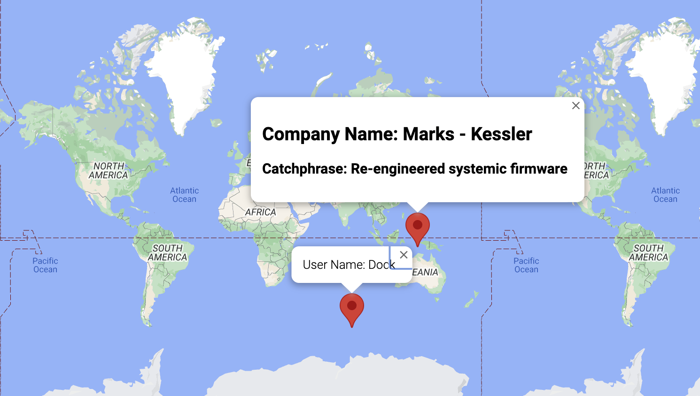

# User and Company Locations Map

This is a TypeScript web application that displays the locations of users and companies on a map. It provides a visual representation of the geographical distribution of users and companies, allowing for easy identification and analysis of their locations.

## Features

-   User and Company Markers: The app plots markers on the map to represent the locations of users and companies. Each marker provides information about the user or company it represents.

## Installation and Usage

1. Clone the repository
2. Install the required dependencies: `npm install`.
3. Obtain the necessary API keys for the mapping service you intend to use (e.g., Google Maps API).
4. Configure the API keys in the application in the index.html.
5. Customize the user and company data in the code to match your specific requirements.
6. Start the web app: `npx parcel index.html`.
7. Open the web app in your browser: `http://localhost:1234`.

## Technologies Used

-   TypeScript
-   Mapping Service (e.g., Google Maps API)
-   API Integration
